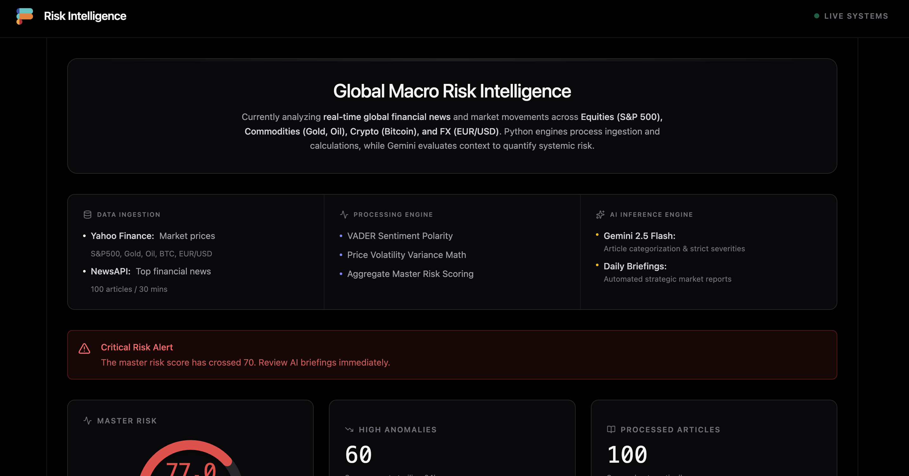
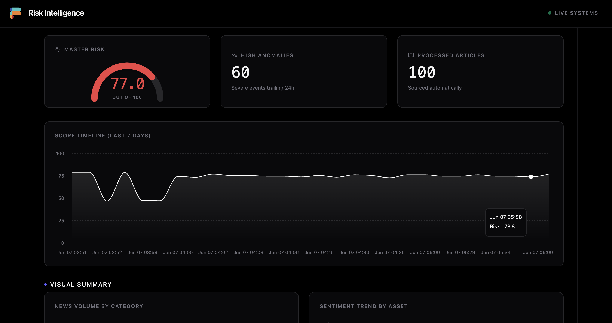
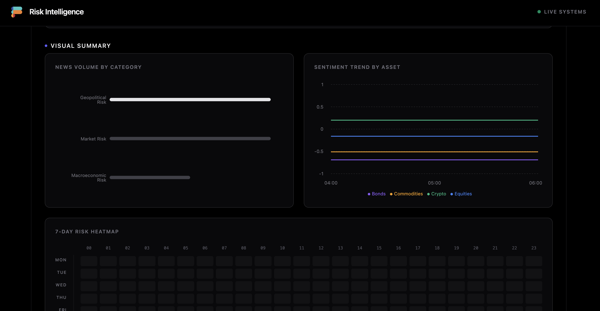
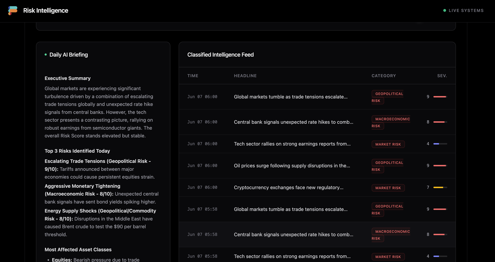

# Automated Risk Intelligence Analyst

An AI-powered, full-stack application that monitors, analyzes, and visualizes geopolitical and macroeconomic risks in real-time. It ingests news data, uses AI to evaluate risk severity and sentiment, and provides interactive dashboards and daily executive briefings.

## Features

- **Real-Time Dashboard**: Interactive visual summary of risks, sentiment trends, and geographical impacts.
- **7-Day Risk Heatmap**: Quickly identify times of the day and days of the week with the most critical risk occurrences.
- **Automated Ingestion**: Periodic background tasks that fetch and process market and geopolitical news.
- **AI-Powered Analysis**: Utilizes Google's Gemini models to assess risk severity, categorize risk types, and generate daily executive reports.
- **Docker Ready**: Configured for seamless deployment on platforms like Render using a multi-stage Docker build.

## Tech Stack

- **Frontend**: React 18, Vite, Tailwind CSS, Recharts, Lucide Icons.
- **Backend**: Python 3.11, FastAPI, SQLite, Google GenAI SDK.
- **Deployment**: Docker, Vercel compatible (configuration included).

## Prerequisites
- Node.js 18+
- Python 3.11+
- A Google Gemini API Key

## Screenshots

### Visual Analytics
Comprehensive visual summary including news volume by category, sentiment trends by asset class, and 7-day risk heatmap:



### Risk Metrics & Timeline
Master risk score gauge, high anomalies counter, processed articles count, and historical score timeline (last 7 days):



### System Status & Intelligence Feed
Global macro risk intelligence overview showing data ingestion sources, processing engines, AI inference capabilities, and critical risk alerts:



### Dashboard Overview
The main dashboard displays real-time risk intelligence with daily AI briefings and classified intelligence feed:



## Local Development

### 1. Clone the repository and set up Environment Variables
Create a `.env` file in the root directory and add your Gemini API Key:
```env
GEMINI_API_KEY=your_gemini_api_key_here
```

### 2. Frontend Setup
Install the necessary npm dependencies for the React app:
```bash
npm install
```

Start the Vite development server:
```bash
npm run dev:ui
# (or just use `npm run dev` if you prefer the UI alone without python backend)
```

### 3. Backend Setup (Python / FastAPI)
It is recommended to run the backend in a virtual environment.

```bash
# Create and activate a virtual environment
python -m venv venv
source venv/bin/activate  # On Windows use: venv\Scripts\activate

# Install Python dependencies
pip install -r requirements.txt

# Start the FastAPI server
npm run dev:python
# or manually: uvicorn api.index:app --reload --port 8000
```
The FastAPI backend runs on `http://localhost:8000`.

## Deployment (Render via Docker)

This application is fully Dockerized for deployment on platforms like Render. The `Dockerfile` handles building the React frontend and setting up the FastAPI backend to serve both the API and the static files.

### Steps to Deploy on Render:

1. Create a **New Web Service** on Render.
2. Select your connected GitHub repository.
3. Choose the **Docker** runtime environment.
4. Set the necessary Environment Variables (e.g., `GEMINI_API_KEY`).
5. Render will automatically build the multi-stage Docker container and start the app securely.

## API Endpoints Overview

- `GET /api/health` - Server health status.
- `GET /api/data` - Retrieves the compiled dashboard summary data (latest articles, scores, daily report).
- `POST /api/trigger-ingestion` - Manually triggers the data ingestion cycle.
- `POST /api/trigger-report` - Manually triggers the generation of the daily executive risk report.
