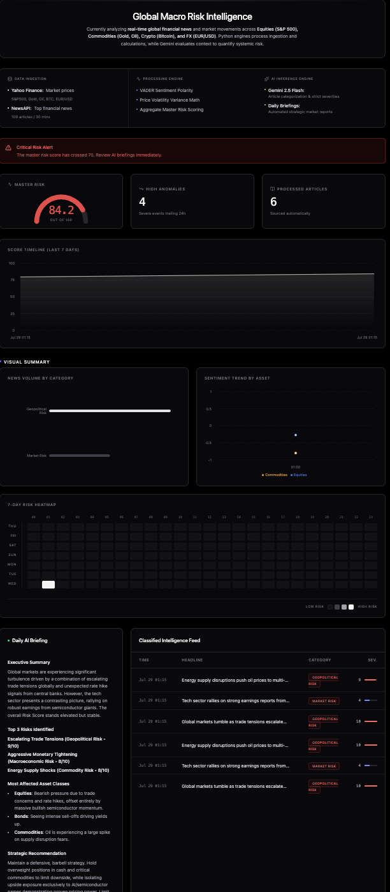
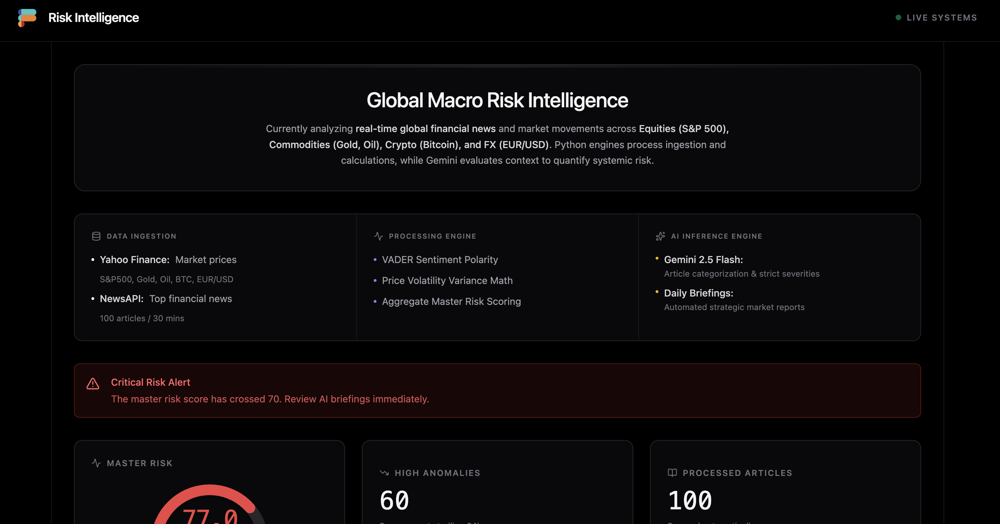
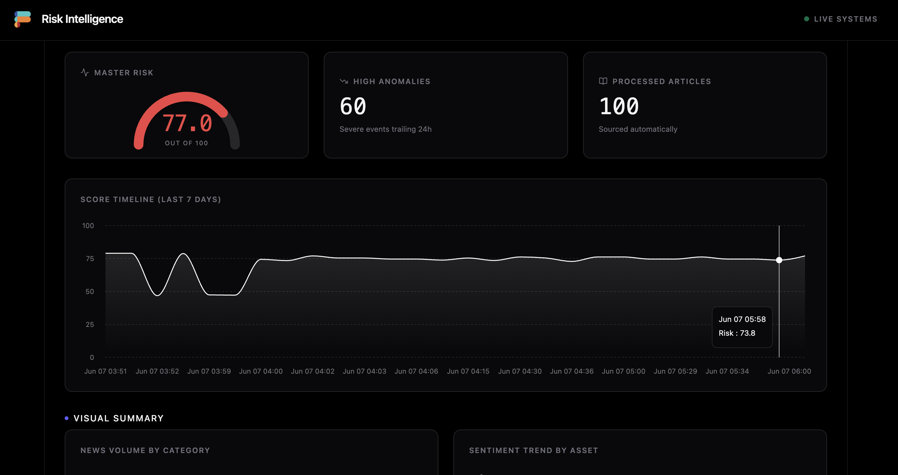
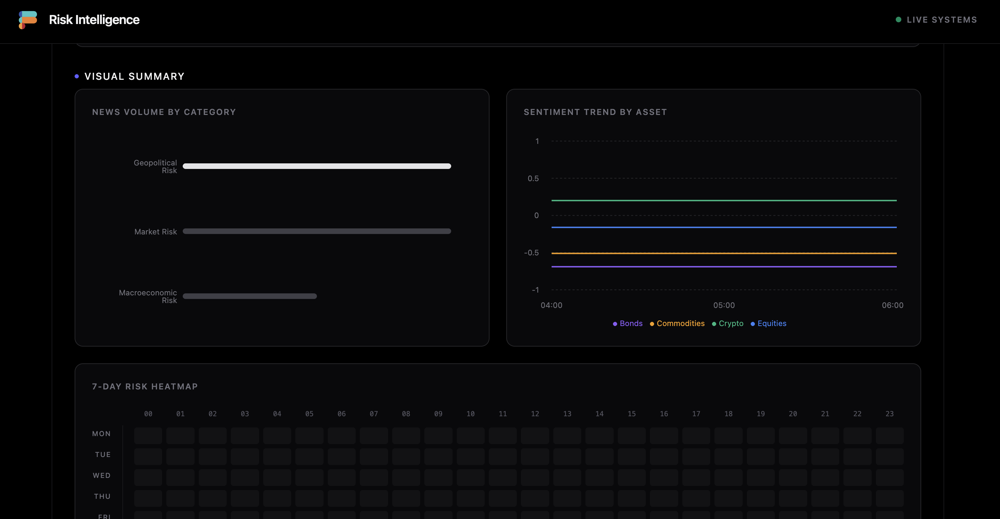
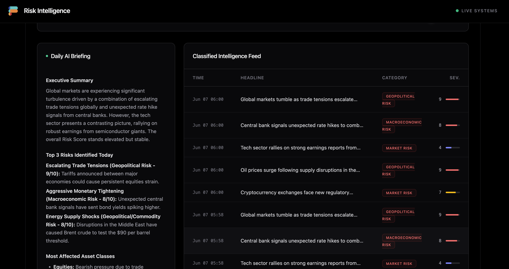

# Automated Risk Intelligence Analyst

**An end-to-end market risk surveillance platform that ingests live financial news, classifies every headline with an LLM against a fixed risk taxonomy, quantifies systemic risk into a single 0-100 score, and publishes an automated daily risk briefing in the format a sell-side or buy-side risk desk would actually consume.**

The system replicates the daily workflow of a junior risk analyst: pull the tape, read the news flow, classify each headline by risk type and severity, score the aggregate exposure, and write the morning briefing. It runs unattended on a 30-minute ingestion cycle with a scheduled daily report.

Repository: https://github.com/thedeepakreddy/Automated-Risk-Intelligence-Analyst

---

## Dashboard

[](./image.png)

*Full dashboard view: master risk gauge, 7-day score timeline, sentiment trend by asset class, risk heatmap, AI-generated daily briefing, and the classified intelligence feed.*

---

## Why This Project

Risk desks do not fail for lack of data; they fail because unstructured news flow is not converted into a comparable, time-series metric fast enough to act on. This project addresses that gap directly:

- **Unstructured to structured.** Every headline is classified into a standard risk taxonomy (Market, Credit, Geopolitical, Liquidity, Regulatory, Operational) with an affected-asset mapping and a 1-10 severity score.
- **A single defensible number.** Severity, sentiment, and the realized volatility of the news flow itself are normalized and combined into one Master Risk Score, so risk is trackable over time rather than assessed anecdotally.
- **Analyst output, not just a chart.** The system produces a written Executive Summary, Top 3 Risks, Most Affected Asset Classes, Trend Analysis, and a Strategic Recommendation each morning.

---

## Risk Methodology

The Master Risk Score is a transparent, weighted composite on a 0-100 scale, computed over the trailing 24 hours of classified articles. Nothing in the score is a black box, and nothing in it is random.

| Component | Weight | Derivation |
|---|---|---|
| News Severity | 40% | Mean LLM-assigned severity across risk-bearing articles in the window, rescaled 0-10 to 0-100 |
| Sentiment Risk | 30% | Mean sentiment polarity across the window, inverted and rescaled so negative tone raises risk (-1 to 100, 0 to 50, +1 to 0) |
| News-Flow Volatility | 30% | Population standard deviation of hour-over-hour changes in mean severity, capped at 3.0 severity points and rescaled to 0-100 |

```
MasterRiskScore = 0.40 * NormalizedSeverity
                + 0.30 * NormalizedSentimentRisk
                + 0.30 * NormalizedNewsVolatility
```

**News-flow volatility** is the realized-volatility analogue applied to the news stream rather than to prices. Mean severity is bucketed by hour to form a series, first differences are taken (the analogue of returns), and the standard deviation of those differences is the volatility reading. A desk that sees severity lurch between calm and severe hour to hour is in a more unstable regime than one sitting at a constant elevated level, and the score says so.

**Cold-start handling.** Volatility needs at least three hourly buckets. Until it has them, the component is marked unavailable and the remaining weights are renormalized to sum to 1, rather than scoring a missing component as zero and reading as artificially calm.

Every scoring run persists its full decomposition alongside the output score - each component's normalized value, nominal weight, effective weight and contribution, plus `avgSeverity`, `avgSentiment`, `newsVolatility`, the article counts and the number of degraded classifications - so any historical reading can be decomposed and audited after the fact. The same decomposition is served live on `GET /api/methodology` and inside `GET /api/data`.

---

## System Architecture

```
        Public RSS feeds (Reuters, Bloomberg, CNBC, Yahoo Finance,
                 MarketWatch, BBC Business - no API key required)
                                  |
                                  v
              +-------------------------------------------------------+
              |            INGESTION CYCLE (every 30 minutes)         |
              |  - Fetch latest headlines, interleaved across sources |
              |  - Drop anything already ingested (title + URL hash)  |
              |  - Gemini 2.5 Flash risk classification (JSON schema) |
              |  - Strict schema validation; off-contract = dropped   |
              |  - Weighted Master Risk Score computation             |
              +-------------------------------------------------------+
                                       |
                                       v
                     SQLite: articles | system_scores | reports
                                       |
                       +---------------+---------------+
                       v                               v
          REPORTER (daily)                    FastAPI  /api/data
          Gemini-authored risk briefing        React 19 + Recharts dashboard
```

**Data model:** three normalized tables (`articles`, `system_scores`, `reports`) with a full timestamped history, enabling the 7-day score timeline, the day-by-hour risk heatmap, and per-asset sentiment trends. Every article row carries its provenance (`source`, `classificationMode`, `classificationModel`, `dedupeKey`); every score row carries its full component decomposition. A `UNIQUE` index on `dedupeKey` is the hard guarantee that one story is stored exactly once.

**Resilience:** the pipeline degrades gracefully rather than failing, and says so when it does.

- A feed that 403s, times out or retires is logged and skipped; the cycle continues on the remaining sources.
- If the LLM **answers off-contract** - a value outside the taxonomy, a severity out of range, unparseable JSON - the article is logged and **dropped**. Substituting a keyword guess here would put a rule-based reading in the database wearing the label of real inference.
- If the LLM **cannot be reached at all** (no API key, quota exhausted, network failure), classification falls back to a deterministic keyword classifier with real VADER sentiment, and every affected row is stamped `classificationMode = 'degraded-keyword'`. The briefing falls back to a template assembled from the day's real figures, stamped `degraded-template` and carrying a visible banner.

A risk system that goes dark under load is worse than one that reports with a known, disclosed methodology downgrade - but only if the downgrade is actually disclosed, which is why it is recorded per row rather than inferred.

---

## Key Features

- **Master Risk Gauge** with a critical-threshold alert that fires when the composite score crosses 70.
- **7-Day Score Timeline** to distinguish a genuine regime shift from single-headline noise.
- **Day-by-Hour Risk Heatmap** surfacing when critical events cluster across the week.
- **Sentiment Trend by Asset Class**, tracking tone separately for Equities, Commodities, FX, Bonds, and Crypto.
- **News Volume by Risk Category**, showing where the risk concentration sits today.
- **Classified Intelligence Feed** with per-headline risk type, severity (1-10), and timestamp.
- **Daily AI Briefing** rendered as Markdown in the analyst's standard report structure, written from that day's actual classified articles and actual computed score.
- **Manual override endpoints** to force an ingestion cycle or regenerate the briefing on demand, returning the full cycle summary.
- **Published methodology endpoint** so the score can be explained, not just displayed.

---

## Tech Stack

| Layer | Technology |
|---|---|
| Frontend | React 19, TypeScript, Vite, Tailwind CSS 4, Recharts, Lucide |
| Backend | Python 3.11, FastAPI, Uvicorn, asyncio background schedulers |
| Data | SQLite (`sqlite3`) |
| News ingestion | `feedparser` + `requests` over free public RSS feeds (no API key) |
| Quant / NLP | Google Gemini 2.5 Flash (structured JSON output), VADER sentiment on the degraded path |
| Deployment | Multi-stage Docker build, Render-ready, Vercel configuration included |

The `src/server/*.ts` files are a legacy TypeScript prototype of the same pipeline, kept for reference. The service that builds, deploys and runs is the Python backend under `api/`.

---

## API Reference

| Method | Endpoint | Description |
|---|---|---|
| `GET` | `/api/health` | Service health, backend identity, and whether AI inference is configured or degraded |
| `GET` | `/api/data` | Dashboard payload: articles, 7-day score history, current briefing, score decomposition, methodology, source list |
| `GET` | `/api/methodology` | Scoring weights, formula and per-component derivations |
| `POST` | `/api/trigger-ingestion` | Force an out-of-cycle ingestion and rescore; returns the cycle summary |
| `POST` | `/api/trigger-report` | Force regeneration of the daily executive briefing |

---

## Running Locally

**Prerequisites:** Node.js 18+, Python 3.11+, a Google Gemini API key. News ingestion needs no key - it reads public RSS feeds. Without a Gemini key the system still runs, in clearly-labelled degraded mode.

**1. Environment**

```bash
git clone https://github.com/thedeepakreddy/Automated-Risk-Intelligence-Analyst.git
cd Automated-Risk-Intelligence-Analyst
```

Create a `.env` file in the project root:

```env
GEMINI_API_KEY=your_gemini_api_key_here
```

**2. Frontend**

```bash
npm install
npm run dev
```

**3. Backend**

```bash
python -m venv venv
source venv/bin/activate          # Windows: venv\Scripts\activate
pip install -r requirements.txt
npm run dev:python                # or: uvicorn api.index:app --reload --port 8000
```

The API serves on `http://localhost:8000`. On first start the backend seeds the database in the background and begins the 30-minute ingestion loop automatically.

**4. Tests**

```bash
pip install -r requirements-dev.txt
pytest
```

The suite covers the classification schema contract (including that an off-contract response is dropped rather than silently downgraded), the Master Risk Score formula against hand-computed values, deduplication across repeated ingestion cycles, and both report paths.

**Configuration**

| Variable | Default | Purpose |
|---|---|---|
| `GEMINI_API_KEY` | - | Enables real classification and AI briefings. Absent = degraded mode. |
| `GEMINI_MODEL` | `gemini-2.5-flash` | Inference model. |
| `GEMINI_MAX_RPM` | `10` | Requests/minute ceiling for classification. Matches the free tier; raise it on a paid key, set `0` to disable pacing. |
| `GEMINI_MAX_RETRIES` | `2` | Retries on a throttled (429) or transient (5xx) response, with exponential backoff. |
| `GEMINI_BREAKER_THRESHOLD` | `3` | Consecutive quota failures before the cycle stops calling Gemini and finishes on the keyword classifier. |
| `RSS_FEEDS` | built-in list | Comma-separated `Name\|URL` overrides for the news sources. |
| `MAX_ARTICLES_PER_CYCLE` | `20` | Headlines admitted per cycle. |
| `MAX_ARTICLES_PER_FEED` | `10` | Headlines taken from any one source before moving on. |
| `INGESTION_INTERVAL_SECONDS` | `1800` | Ingestion cadence. |
| `REPORT_INTERVAL_SECONDS` | `86400` | Briefing cadence. |
| `DB_PATH` | `/tmp/risk.db` | SQLite location. |
| `LOG_LEVEL` | `INFO` | Logging verbosity. |

---

## Deployment

The application ships as a single multi-stage Docker image: the React bundle is built and then served as static assets by FastAPI alongside the API, so the whole stack runs as one web service.

1. Create a new Web Service on Render and connect this repository.
2. Select the Docker runtime.
3. Set `GEMINI_API_KEY` as an environment variable.
4. Deploy. Background ingestion and the daily reporter start with the service.

---

## Additional Views

**Visual analytics** - news volume by category, sentiment trend by asset class, and the 7-day risk heatmap:



**Risk metrics and timeline** - master risk gauge, high-anomaly count, processed article volume, and the trailing 7-day score:



**System status** - data ingestion sources, processing engines, AI inference layer, and the critical risk alert banner:



**Briefing and intelligence feed** - the daily AI briefing beside the classified, severity-ranked headline feed:



---

## Design Decisions and Known Limitations

Stated openly, because a risk model that hides its assumptions is not a risk model.

- **SQLite over a hosted database.** Chosen for zero-configuration reproducibility and single-container deployment. A production deployment would move to PostgreSQL or a time-series store for concurrent writes and longer retention.
- **The composite weights (40/30/30) are a documented prior, not a calibrated fit.** They live in one place (`api/_config.py`) and are published on `/api/methodology`, so they can be back-tested and re-estimated against realized drawdowns.
- **Volatility is measured on the news flow, not on prices.** This keeps the pipeline keyless and self-contained, but it inherits the defining property of any volatility measure: a regime *pinned* at maximum severity registers as low volatility, because nothing is moving. A sustained worst-case day therefore tops out near 70 rather than near 100 unless the flow is also churning. Cross-asset realized volatility from a market data feed is the natural upgrade and is on the roadmap below.
- **LLM classification is non-deterministic.** Output is constrained to a strict JSON schema with a fixed risk taxonomy and validated before storage; anything off-contract is dropped rather than coerced. Severity scores should be read as an ordinal ranking, not a cardinal measurement.
- **Degraded-mode sentiment uses VADER**, a lexicon tuned for general English rather than financial text. A finance-specific model (for example, FinBERT) would be the natural next upgrade.
- **Coverage is headline-level.** The system reads titles and RSS summaries, not full article bodies or filings.
- **RSS sources are best-effort.** Publishers retire and rate-limit feeds without notice. Sources are configurable via `RSS_FEEDS`, failures are logged per source, and the cycle proceeds on whatever remains.
- **LLM throughput is the binding constraint on cycle size.** One classification call per headline against a free-tier quota of roughly 10 requests/minute means a 20-headline cycle takes about two minutes of wall clock, and 48 cycles a day will exceed a free daily cap well before midnight. Calls are paced, throttled responses retried with backoff, and a breaker stops the cycle asking once the quota is genuinely spent — but the real fix at volume is batching several headlines per request, or a paid tier. Until then, `MAX_ARTICLES_PER_CYCLE` and `INGESTION_INTERVAL_SECONDS` are the dials that keep a day's ingestion inside a day's quota.

---

## Roadmap

- Reintroduce cross-asset realized volatility from a market data feed as the volatility component, with news-flow volatility retained as the keyless fallback.
- Back-test the Master Risk Score against realized volatility and equity drawdowns to calibrate the component weights empirically.
- Replace VADER with a finance-domain sentiment model on the degraded path.
- Add value-at-risk and stress-scenario modules driven by ingested price history.
- Extend coverage to fixed income, credit spreads, and central bank communications.
- Migrate persistence to PostgreSQL with a time-series retention policy.

---

## Author

**Deepak Reddy** - built as a demonstration of end-to-end risk analytics engineering: data ingestion, quantitative scoring methodology, NLP-driven classification, and the analyst-facing reporting layer that sits on top of them.

GitHub: [thedeepakreddy](https://github.com/thedeepakreddy)
